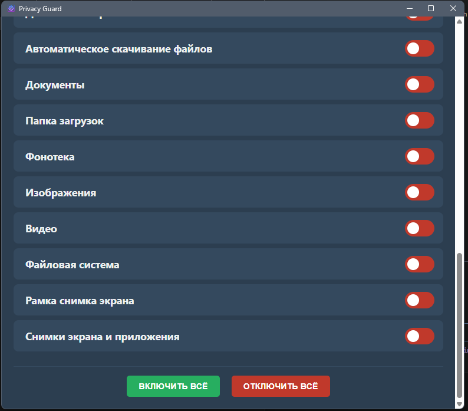

## 📸 Скриншоты


# 🌐 Краткое описание проекта

🔐 Это Electron-приложение для управления приватностью в Windows — легко контролируйте доступ к камере, микрофону и геолокации.  
👨‍💻 Простой интерфейс и работа с реестром без лишних усилий.  
📦 Легко устанавливается и не требует дополнительных зависимостей.

# 🌟 Особенности

- 🎛️ Удобный графический интерфейс для изменения параметров реестра Windows  
- 🔍 Просмотр и редактирование ключей реестра на уровне пользователя и системы  
- ⚙️ Управление доступом к системным функциям приложений (камера, микрофон, геолокация)  
- 📦 Легкая установка без необходимости в дополнительных зависимостях  
- 🔒 Поддержка безопасности: управление правами с возможностью запуска от имени администратора  

# 💻 Технологии

- Electron — среда для desktop-приложений  
- Node.js — среда выполнения JavaScript  
- Windows Registry API — работа с реестром Windows  
- HTML/CSS/JavaScript — фронтенд интерфейса  

# 🧰 Зависимости

- [Node.js](https://nodejs.org/) (версия 14 или выше)  
- [npm](https://www.npmjs.com/) (входит в Node.js)  
- Права администратора для изменения некоторых параметров  

# ⚙️ Предварительная настройка

Перед началом работы убедитесь, что у вас установлен [GitHub CLI](https://cli.github.com/). После этого выполните команду:

```bash
gh auth refresh -h github.com -s workflow
```

Это предоставит необходимые права для создания релизов через GitHub Actions.

# 🛠️ Установка

1. Склонируйте репозиторий:  
```bash
git clone https://github.com/ваш_пользователь/PARAMETERS.git
```
2. Перейдите в директорию проекта:  
```bash
cd PARAMETERS
```
3. Установите зависимости:  
```bash
npm install
```

# ▶️ Запуск

### Локально

- Для запуска в режиме разработки:  
```bash
npm run start
```
или  
```bash
npm run dev
```

- Для сборки приложения:  
```bash
npm run build
```

# 🧪 Использование

После запуска вы можете:
- Навигировать по категориям: Камера, Микрофон, Геолокация и другие  
- Включать/выключать доступ к функциям с помощью переключателей  
- Использовать кнопки "ВКЛЮЧИТЬ ВСЁ" и "ОТКЛЮЧИТЬ ВСЁ" для массового управления  
- Редактировать ключи реестра напрямую через удобный интерфейс  

⚠️ Для изменения некоторых параметров может потребоваться запуск от имени администратора.

# ⚙️ Конфигурация

Приложение использует стандартные настройки по умолчанию. Дополнительная конфигурация не требуется для базового функционала.

# 🧑‍💻 Разработка

Если вы хотите помочь с разработкой:

1. Установите Node.js и npm  
2. Склонируйте репозиторий  
3. Запустите `npm install`  
4. Используйте `npm run dev` для запуска в режиме разработки  
5. Для тестирования используйте `npm test`, если есть соответствующие тесты  

*Создано с ❤️ и заботой о вашей приватности*


